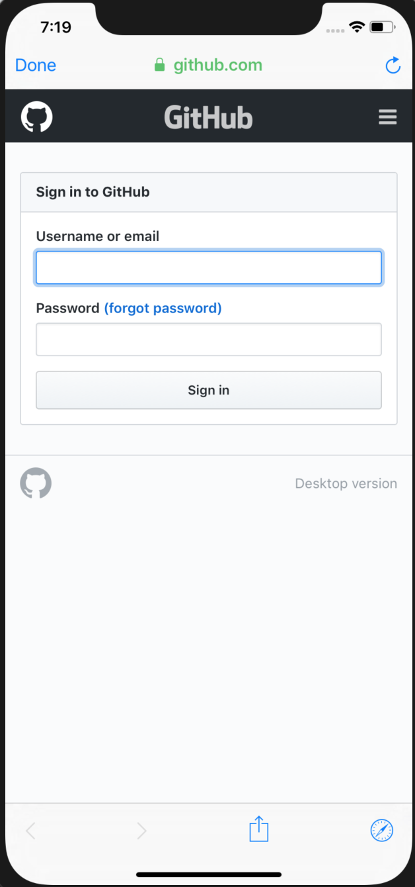
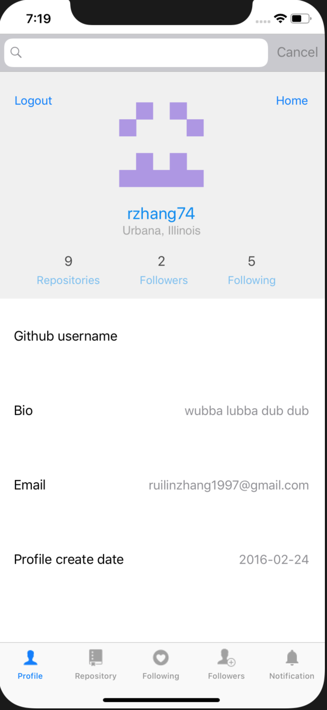
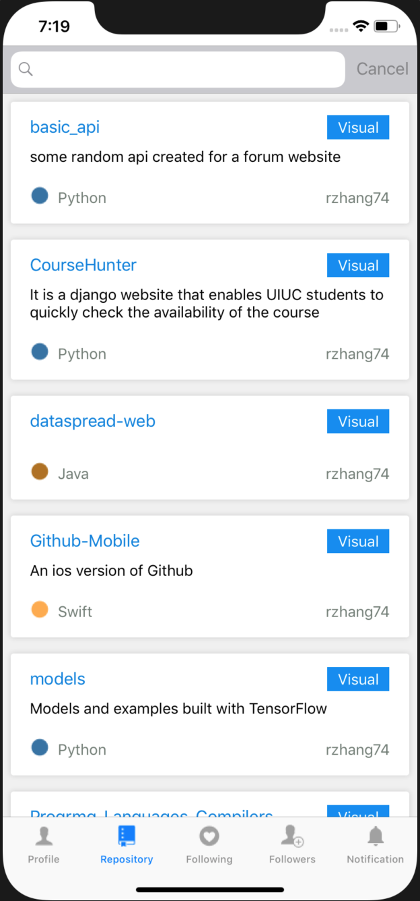
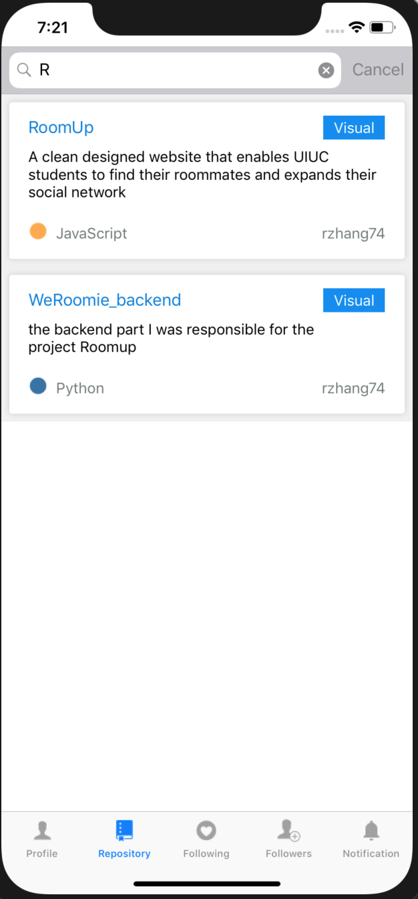
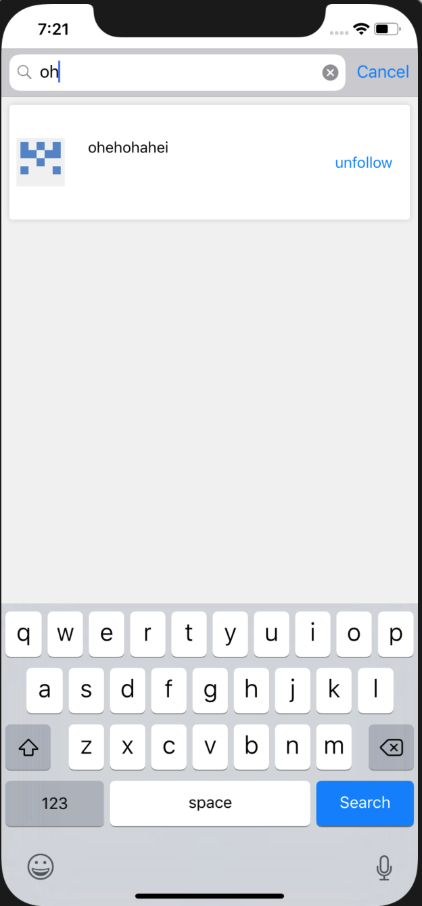
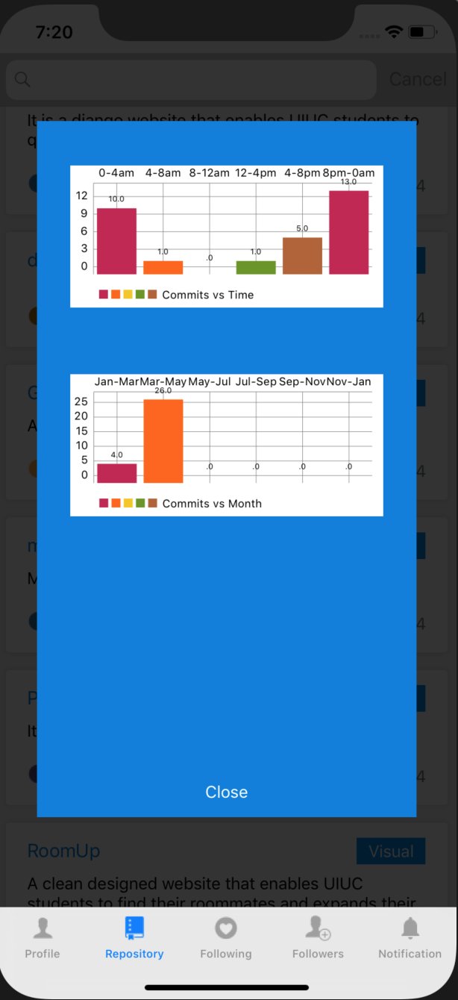

# Github-Mobile

An ios version of Github

It is a tab bar app designed for people to conveniently access their Github account instead of doing so on computer or on webpage.

The functionality includes:

* User can login and logout using their Github account through OAuth(Any existing Github user can do)

* User can view basic profile information on the profile page. Basic profile information includes number of repositories, number of followers, number of following, user's avatar, login name, username, bio, email, create date, etc.

* User can view his/her repositories on the repository page. Infomartion of project name, description and main project's language will be displayed. Clicking the repository cell will redirect you to the Github repository page in Safari. (Further implementation will allow user to view the detailed repo info insider the app)

* User can view basic info of their followers on the follower page. Clicking the follower cell will redirect you in the app to the follower's profile page. User can then view the follower's repository, following and follower page. Clicking home on the profile page will get you back to your own main page.

* User can view basic info of their following on the following page. Clicking the following cell will redirect you in the app to the following's profile page. User can then view the following's repository, following and follower page. Clicking home on the profile page will get you back to your own main page.

* User can follow and unfollow other users on the follower and following page.

* The data you view will be stored and cached on the Firebase realtime database, which will reduce the heavy requests sent to Github api.

* The user can view his/her own Github notification on the notification page

* If user has a lot of repos, followers, or followings, he/she can search and filter through keyword in the search bar. The repos returned are sorted based on language and the users returned are sorted based on login name.

* User can view visualization of his/her own repos as well as others', by clicking visual button on the repo cell. For now two visualizations are provided. User can view his/her repos' commit times during different time interval(8pm-12pm, 0am-4am, etc.) and his/her repos' commit times during different month periods(Jan-Mar, May-Jul, etc.)

Some screenshots provided:

